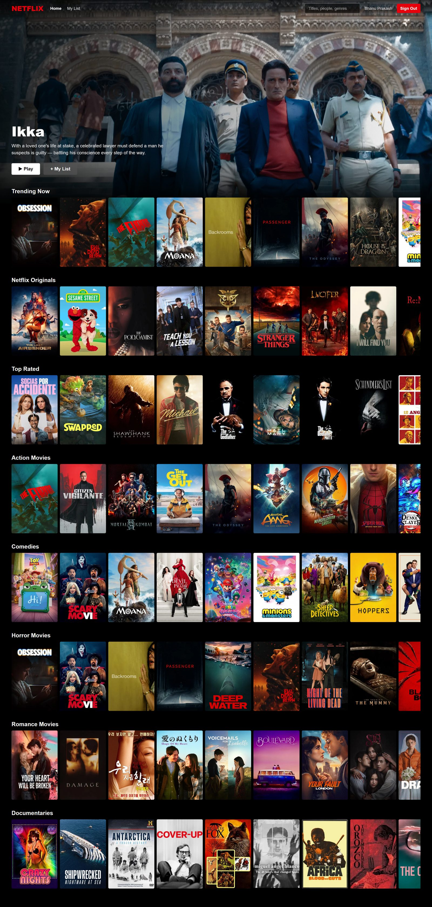
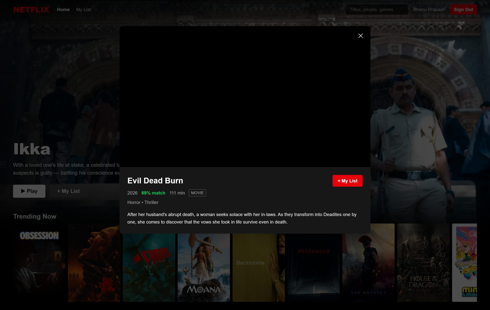
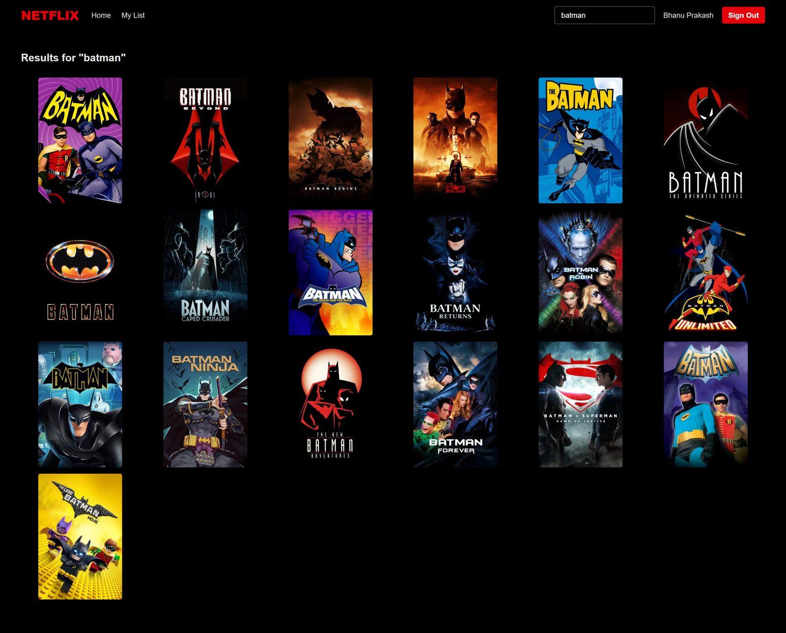
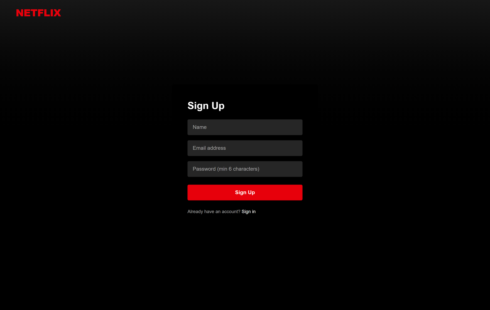

<div align="center">

# 🎬 Netflix Clone

### A Netflix-Style Streaming UI on Live TMDB Data

*A full-stack, pixel-faithful Netflix experience — a cinematic hero banner, eight live genre rows, a trailer-playing detail modal, debounced search, and a per-user watchlist — powered by the **TMDB API**, proxied through a server so the API key never touches the browser.*

<br/>

[](https://react.dev/)
[](https://vitejs.dev/)
[](https://www.typescriptlang.org/)
[](https://tailwindcss.com/)
[](https://expressjs.com/)
[](https://www.mysql.com/)
[](https://www.themoviedb.org/)

[](LICENSE)


</div>

---

## 📖 Overview

**Netflix Clone** is a full-stack, Netflix-style streaming front-end built with
**React + Vite + TypeScript** (client), **Express + TypeScript** (server), and
**MySQL** (database). A registered user browses **live movie & TV data from
[TMDB](https://www.themoviedb.org/)** — trending titles, genre rows, posters,
ratings, and official YouTube trailers — all styled to feel like the real thing.

The detail that makes it more than a UI clone is the **backend-for-frontend**: the
server proxies every TMDB call, so the API key stays on the server and never ships
to the browser, and it owns the two things TMDB can't — **authentication** and a
**per-user watchlist** persisted in MySQL.

> **The one-liner:** a React SPA talks only to its own Express API; the server
> bcrypt-hashes passwords, issues JWTs, keeps the TMDB key secret, fans out the
> eight home rows with `Promise.all`, and persists each user's *My List* in MySQL.

---

## ✨ Features

- 🔐 **Auth** — register / login with **JWT + bcrypt**; every route except login/register is gated by a `ProtectedRoute`.
- 🎬 **Browse** — a cinematic **hero banner** with a random trending title, above **8 genre rows** (Trending, Netflix Originals, Top Rated, Action, Comedy, Horror, Romance, Documentaries) — all live from TMDB.
- 🎞️ **Detail modal** — click any title for details, genres, rating, and the official **YouTube trailer** (via TMDB's `append_to_response=videos`, played with `react-youtube`).
- 🔎 **Search** — debounced multi-search across movies *and* TV shows, rendered as a results grid.
- ➕ **My List** — a per-user watchlist persisted in MySQL, with add/remove and a unique constraint so a title can't be saved twice.
- 🔒 **Secret API key** — TMDB is proxied through the server, so the key never reaches the client.
- ⚡ **Parallel fan-out** — the eight home rows resolve with `Promise.all`, so latency ≈ the slowest single call, not the sum.

---

## 📸 Screenshots

### Home — *cinematic hero + eight live genre rows*

<div align="center">
  
</div>

<table>
  <tr>
    <td width="50%">
      <b>🎞️ Detail Modal</b><br/>
      <sub>Full details, genres, rating and the official YouTube trailer for any title.</sub><br/><br/>
      
    </td>
    <td width="50%">
      <b>🔎 Search</b><br/>
      <sub>Debounced multi-search across movies and TV, rendered as a results grid.</sub><br/><br/>
      
    </td>
  </tr>
</table>

<div align="center">
  <b>🔐 Authentication</b><br/>
  <sub>Netflix-style sign-up / sign-in — bcrypt-hashed passwords, JWT sessions.</sub><br/><br/>
  
</div>

---

## 🛠️ Tech Stack

| Layer | Technology |
|-------|-----------|
| **Frontend** | React 19 · Vite · TypeScript · Tailwind CSS 4 · React Router 7 · axios · react-youtube |
| **Backend** | Node.js · Express 5 · TypeScript |
| **Database** | MySQL (`mysql2`) |
| **Auth** | JWT (jsonwebtoken) + bcryptjs |
| **Data source** | TMDB API (proxied server-side) |
| **Tooling** | npm workspaces-style orchestration · concurrently · tsx · oxlint |

> 📐 A deeper dive — the TMDB proxy, the parallel fan-out, and the auth flow — lives in **[`docs/ARCHITECTURE.md`](docs/ARCHITECTURE.md)**.

---

## 🚀 Getting Started

### Prerequisites
- **Node.js** 18+
- **MySQL** running locally
- A free **TMDB API key** — <https://www.themoviedb.org/settings/api> (the v3 API Key or the v4 Read Access Token both work)

### Installation

```bash
# 1. Clone the repository
git clone https://github.com/bhanu87777/Netflix-Clone.git
cd Netflix-Clone

# 2. Install everything (root, server, client)
npm run install:all

# 3. Configure the server
cp server/.env.example server/.env
#   → set DB_USER / DB_PASSWORD (your MySQL creds),
#     JWT_SECRET (any long random string), and TMDB_API_KEY

# 4. Create the database and tables
npm run db:setup

# 5. Run both apps (server on :5000, client on :5173)
npm run dev
```

Open <http://localhost:5173>, create an account, and start browsing.

---

## 📋 Usage

| Command | Description |
|---------|-------------|
| `npm run install:all` | Install dependencies for root, server, and client |
| `npm run dev` | Run server (:5000) **and** client (:5173) together |
| `npm run db:setup` | Create the database and tables |
| `npm run build` | Production build of server + client |

---

## 📁 Project Structure

```
Netflix-Clone/
├── assets/
│   └── screenshots/          # README imagery
├── docs/
│   ├── ARCHITECTURE.md       # TMDB proxy, fan-out & auth deep dive
│   ├── NetflixClone_1_Features_Walkthrough.pdf
│   └── NetflixClone_2_Codebase_Guide.pdf
├── client/                   # React + Vite + TypeScript + Tailwind CSS
│   └── src/
│       ├── api/              # axios instance + typed API functions
│       ├── components/       # Navbar, HeroBanner, Row, MovieCard, MovieModal, ProtectedRoute
│       ├── context/          # AuthContext, WatchlistContext
│       ├── pages/            # Home, Search, MyList, Login, Register
│       ├── lib/              # TMDB image helpers
│       └── types/
└── server/                   # Express + TypeScript (backend-for-frontend)
    └── src/
        ├── config/           # MySQL connection pool
        ├── db/               # schema.sql + setup script
        ├── middleware/       # auth (JWT), error handler
        ├── routes/           # /api/auth, /api/movies, /api/watchlist
        └── services/         # TMDB fetch wrapper (the only place the key is used)
```

---

## 🔌 API Reference

| Method | Endpoint | Auth | Description |
|---|---|:---:|---|
| `POST` | `/api/auth/register` | – | Create account → `{ token, user }` |
| `POST` | `/api/auth/login` | – | Sign in → `{ token, user }` |
| `GET` | `/api/auth/me` | ✔ | Current user from token |
| `GET` | `/api/movies/banner` | – | Random trending title for the hero |
| `GET` | `/api/movies/categories` | – | All home-page rows in one call |
| `GET` | `/api/movies/search?q=` | – | Multi-search (movies + TV) |
| `GET` | `/api/movies/:type/:id` | – | Details + trailer key |
| `GET` | `/api/watchlist` | ✔ | Current user's list |
| `POST` | `/api/watchlist` | ✔ | Add a title |
| `DELETE` | `/api/watchlist/:tmdbId` | ✔ | Remove a title |

---

## 🔭 Future Improvements

- [ ] **Multiple profiles** per account, Netflix-style
- [ ] **Continue watching** & viewing history
- [ ] **Infinite scroll / pagination** on search and rows
- [ ] **Personalized recommendations** from watchlist genres
- [ ] **HTTP-only cookie sessions** with refresh tokens (instead of localStorage JWT)
- [ ] **Skeleton loaders** and image blur-up for smoother loading
- [ ] **Responsive polish** for tablet/mobile breakpoints
- [ ] **Tests** — API integration tests + component tests

---

## 🤝 Contributing

Contributions, issues, and feature requests are welcome!

1. Fork the project
2. Create your feature branch (`git checkout -b feature/amazing-feature`)
3. Commit your changes (`git commit -m 'Add amazing feature'`)
4. Push to the branch (`git push origin feature/amazing-feature`)
5. Open a Pull Request

---

## 📄 License

Distributed under the **MIT License**. See [`LICENSE`](LICENSE) for details.

> This is an educational portfolio project and is **not affiliated with Netflix**.
> "Netflix" and its branding are trademarks of Netflix, Inc.; the name and visual
> style are used here purely to demonstrate front-end engineering. Movie & TV data
> and images are provided by [TMDB](https://www.themoviedb.org/), which this
> product uses but is not endorsed or certified by.

---

## 👤 Author

**Bhanu Prakash M**

[](https://github.com/bhanu87777)

> 💡 If this project helped or impressed you, consider giving the repo a ⭐ — it genuinely helps!

<div align="center">
<sub>Built with React, Express, and MySQL — on live TMDB data, with the key kept safely server-side.</sub>
</div>
