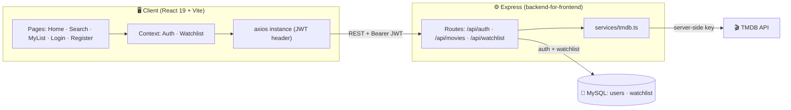
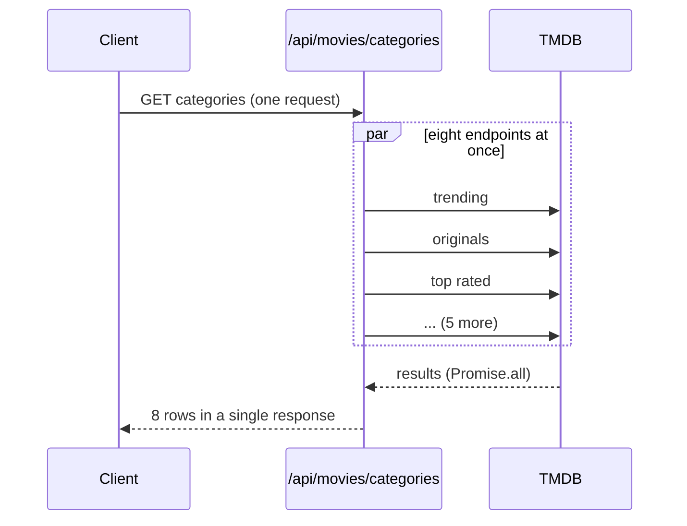

# 🏗️ Netflix Clone — Architecture

A monorepo with two halves: a **React + Vite** client and a thin **Express +
MySQL** backend-for-frontend that proxies **TMDB** so the API key never reaches
the browser.

```
├── client/   React + Vite + TypeScript + Tailwind CSS
└── server/   Express + TypeScript + MySQL   (TMDB proxy + auth + watchlist)
```

---

## 1. System overview



**Why proxy TMDB through the server?** To keep the API key secret. A key embedded
in React ships to every visitor's browser; behind the server it never leaves the
backend. The server is a thin **backend-for-frontend** — it shapes TMDB responses
into exactly what the UI needs and owns the two things TMDB can't: **auth** and
the **per-user watchlist**.

---

## 2. The home page — parallel fan-out

The eight home rows (Trending, Netflix Originals, Top Rated, Action, Comedy,
Horror, Romance, Documentaries) come from eight TMDB endpoints. The server
resolves them with **`Promise.all`**, so total latency ≈ the **slowest single
call**, not the sum of all eight — and the client gets every row in one request
to `/api/movies/categories`.



---

## 3. Auth flow

Register (name + email + password, min 6 chars) → the server **bcrypt-hashes**
the password, stores the user, and returns `{ token, user }`. The JWT is kept
client-side and attached by the axios instance as a `Bearer` header. Protected
routes (`/api/auth/me`, all of `/api/watchlist`) run through the `auth`
middleware, which verifies the token and attaches the user id. On the client, a
`ProtectedRoute` component gates every page except login/register.

---

## 4. Data model (`server/src/db/schema.sql`)

| Table | Purpose |
|-------|---------|
| `users` | Account: `email` (unique), `password_hash` (bcrypt), `name`. |
| `watchlist` | Per-user saved titles: `tmdb_id`, `media_type` (movie/tv), denormalized `title` / `poster_path` / `backdrop_path`. |

`watchlist` has a **`UNIQUE (user_id, tmdb_id, media_type)`** key (you can't add
the same title twice) and a **cascade FK** to `users` (deleting a user clears
their list). Poster/backdrop paths are denormalized onto the row so *My List*
renders without a round-trip back to TMDB.

---

## 5. Server layout (`server/src`)

| File | Responsibility |
|------|----------------|
| `index.ts` | Express app: CORS + JSON, mounts `/api/auth`, `/api/movies`, `/api/watchlist`, error handler. |
| `config/db.ts` | MySQL connection pool (`mysql2`). |
| `db/schema.sql` · `db/setup.ts` | Schema + a script that creates the database and tables. |
| `middleware/auth.ts` | Verifies the JWT and attaches the user. |
| `middleware/errorHandler.ts` | Central error handler. |
| `routes/auth.ts` | Register / login / me. |
| `routes/movies.ts` | Banner, categories (parallel fan-out), search, details + trailer. |
| `routes/watchlist.ts` | List / add / remove (protected). |
| `services/tmdb.ts` | The TMDB fetch wrapper — the only place the API key is used. |

---

## 6. Client layout (`client/src`)

| Area | Files |
|------|-------|
| **Entry** | `main.tsx` (mounts `<App/>`), `App.tsx` (router + `AuthProvider` › `WatchlistProvider`). |
| **API** | `api/client.ts` (axios instance + JWT header), `api/index.ts` (typed API functions). |
| **Context** | `context/AuthContext.tsx`, `context/WatchlistContext.tsx`. |
| **Components** | `Navbar`, `HeroBanner`, `Row`, `MovieCard`, `MovieModal` (YouTube trailer via `react-youtube`), `ProtectedRoute`. |
| **Pages** | `Home`, `Search` (debounced), `MyList`, `Login`, `Register`. |
| **Utils** | `lib/image.ts` (TMDB image URL builder), `types/index.ts`. |

---

## 7. API reference

| Method | Endpoint | Auth | Description |
|---|---|:---:|---|
| `POST` | `/api/auth/register` | – | Create account → `{ token, user }` |
| `POST` | `/api/auth/login` | – | Sign in → `{ token, user }` |
| `GET` | `/api/auth/me` | ✔ | Current user from token |
| `GET` | `/api/movies/banner` | – | Random trending title for the hero |
| `GET` | `/api/movies/categories` | – | All home-page rows in one call |
| `GET` | `/api/movies/search?q=` | – | Multi-search (movies + TV) |
| `GET` | `/api/movies/:type/:id` | – | Details + trailer key |
| `GET` | `/api/watchlist` | ✔ | Current user's list |
| `POST` | `/api/watchlist` | ✔ | Add a title |
| `DELETE` | `/api/watchlist/:tmdbId` | ✔ | Remove a title |
